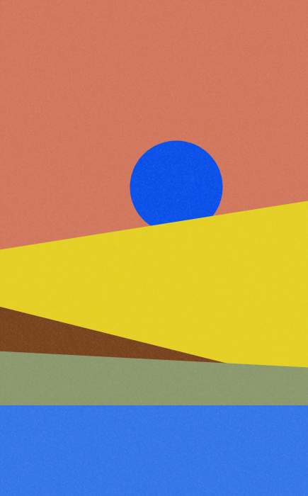

# Modern Art

A few quick n' dirty Processing scripts for generating modern art.

## Examples

### Hillside

      |   
:-------------------------:|:-------------------------:

## Installation

The only prerequisite to run any of these should be [Processing](https://processing.org/) - simply run any of the .pdes to generate images.

## Contributing
Pull requests are welcome. For new files, please submit an issue with examples of the type of art you're aiming to replicate.

Also, please support [the Processing Foundation](https://processingfoundation.org/)!

## License
[Unlicense](https://unlicense.org/).
