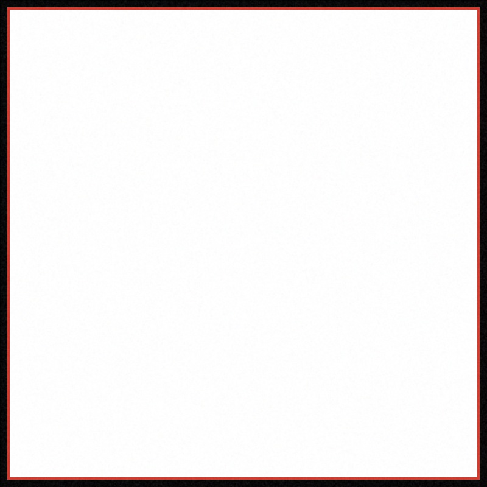
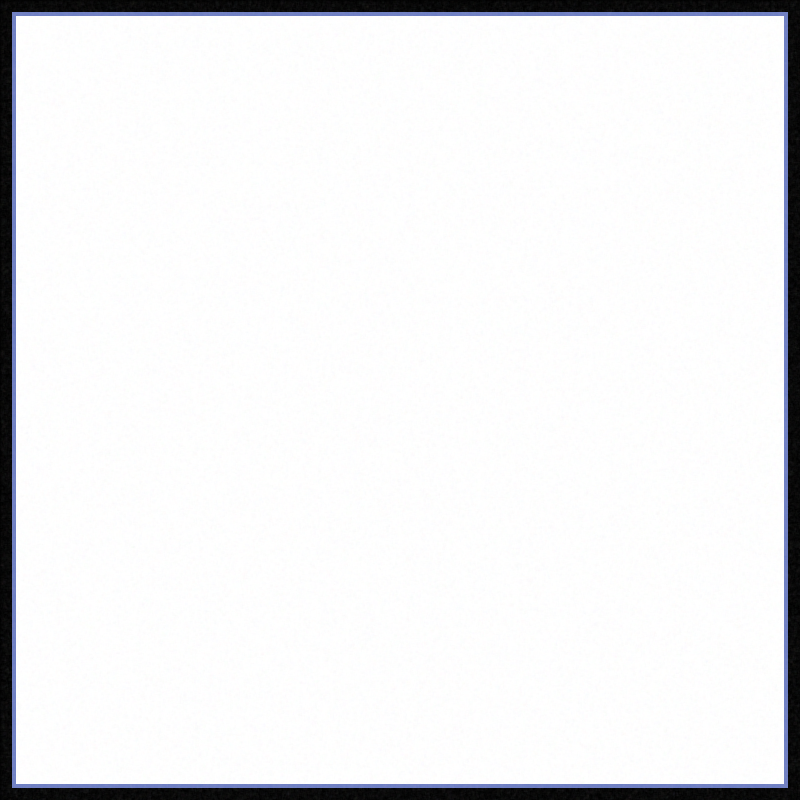
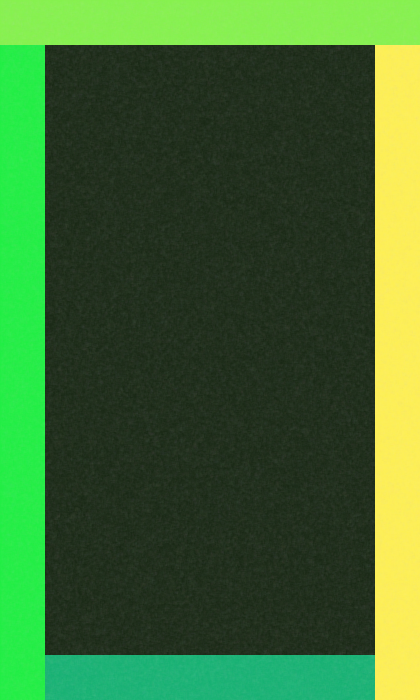
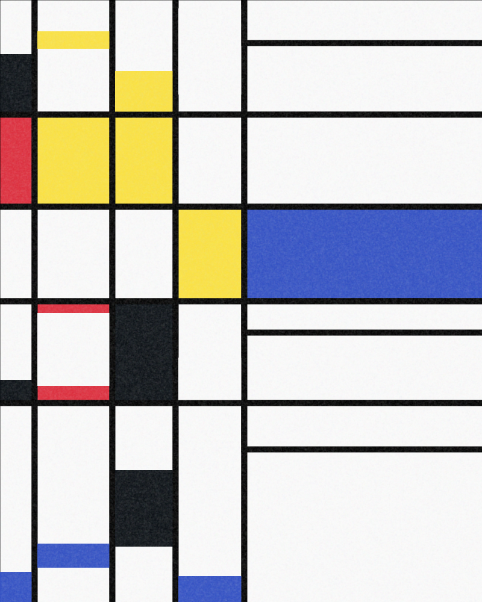
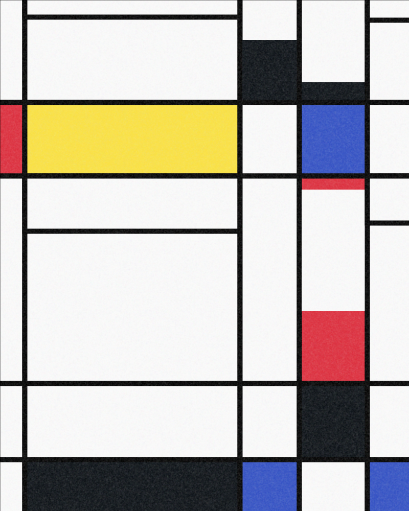

# Modern Art

A few quick n' dirty Processing scripts for generating modern art.

## Installation

The only prerequisite to run any of these should be [Processing](https://processing.org/) - just run any of the .pdes to generate images.

## Contributing
Pull requests are welcome. For new files, please submit an issue with examples of the type of art you're aiming to replicate.

Also, please support [the Processing Foundation](https://processingfoundation.org/)!

## Examples

### Baer

À la [_Primary Art Group_](https://www.moma.org/collection/works/79825?sov_referrer=art_term&art_term_id=59)

      |   
:-------------------------:|:-------------------------:

### Hillside

      |   
:-------------------------:|:-------------------------:

### Knoebel

À la [_Grace Kelly III_](https://zkm.de/en/artwork/grace-kelly-iii-94)

      |   
:-------------------------:|:-------------------------:

### Mondrian

À la [_Trafalgar Square_](https://www.moma.org/collection/works/79879)

      |   
:-------------------------:|:-------------------------:

## License
[Unlicense](https://unlicense.org/).
